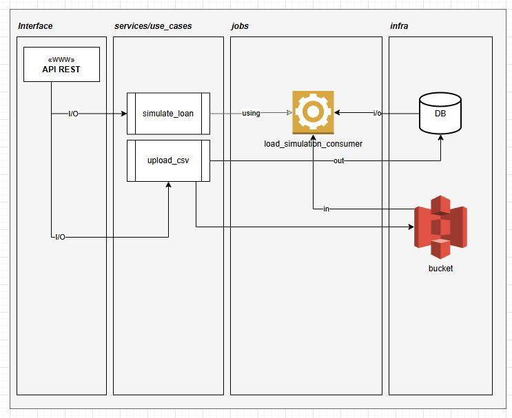

"A palavra realizar pra mim é mágica, ela carrega algo que se eleva além do fazer: O criar. Trazer algo à existência a partir da entropia.", Bruno Darshan

# ✨ Desafio Técnico – Simulação de Empréstimo

Esta aplicação em Ruby on Rails realiza simulações de empréstimo com base em dados fornecidos via CSV, processando cada linha de forma assíncrona e utilizando serviços simulados da AWS (S3 + SQS via LocalStack).

---

## 🧱 Stack utilizada

- Ruby 3.2  
- Rails 8.0  
- Docker + Docker Compose  
- PostgreSQL  
- AWS SDK (S3 + SQS via [LocalStack](https://github.com/localstack/localstack))

---

## 🚀 Como rodar o projeto

### 1. Clone o repositório

```bash
git clone <repo>
cd <repo>
```

### 2. Suba o ambiente com Docker

```bash
docker-compose up --build
```

---

## 🗂️ Funcionalidades implementadas

### ✅ Simulação de empréstimo (`SimulateLoanUseCase`)
Calcula parcelas, total e juros com base em:
- Valor do empréstimo
- Idade (via data de nascimento)
- Prazo em meses

### ✅ Upload e processamento assíncrono de CSV
- Endpoint: `POST /simulate_on_queue`
- Recebe arquivo `.csv` com múltiplas simulações
- Faz upload do arquivo para o S3 (LocalStack)
- Cria um processo com `process_id`
- Retorna o identificador para consulta futura

---

## 📄 Formato do CSV

```csv
10000,1990-01-01,12
15000,1985-05-20,24
```

---

## 📬 Exemplos de requisição

### 📌 Upload de CSV

```bash
curl -X POST http://localhost:3000/simulate_on_queue \
  -H "Content-Type: multipart/form-data" \
  -F "file=@simulacoes.csv"
```

Resposta esperada:
```json
{
  "message": "Upload enviado ao S3 e agendado para processamento",
  "process_id": "123abc-uuid"
}
```

### 📌 Consulta de status (via console)

```bash
docker-compose exec web rails console
QueuedProcess.find_by(process_id: <UUID>)
```

---

## 🧪 Testes

Rodar todos os testes:

```bash
docker-compose run --rm web rails test
```

---

## 🔍 Consultar status do processo

Via console:

```bash
docker-compose run --rm web rails console
QueuedProcess.find_by(process_id: "<process_id>")
```

---

## 📊 Arquitetura da Solução



**Camadas:**

- **Interface (API REST):**
  - Recebe as requisições de simulação (individual ou via upload de CSV)

- **Services / UseCases:**
  - `simulate_loan`: encapsula a lógica de simulação
  - `upload_csv`: lida com o recebimento do arquivo, upload no bucket e criação do processo

- **Jobs: NÃO IMPLEMENTADA** 


- **Infraestrutura:**
  - Banco de dados PostgreSQL
  - Bucket S3 simulado via LocalStack

---

## ✅ Considerações finais

 - Incluiria validações de parametros mais robustas.

## 📝 Licença

Este projeto está licenciado sob os termos da [MIT License](LICENSE).
